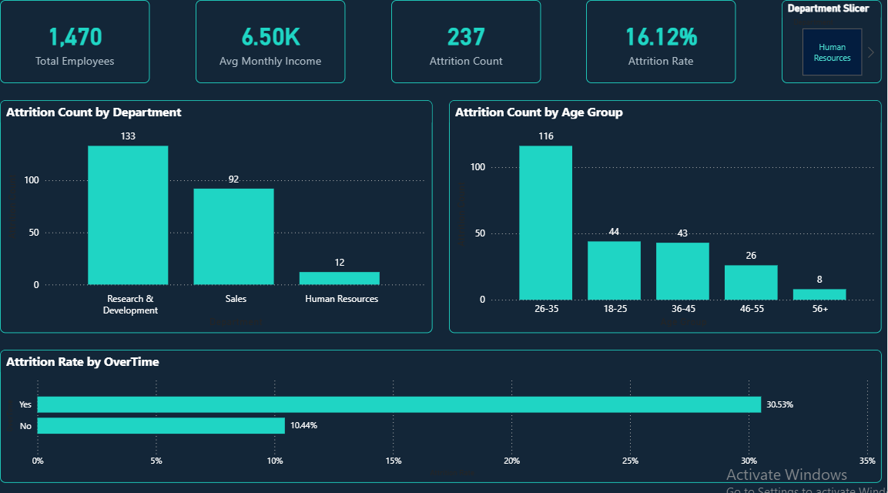
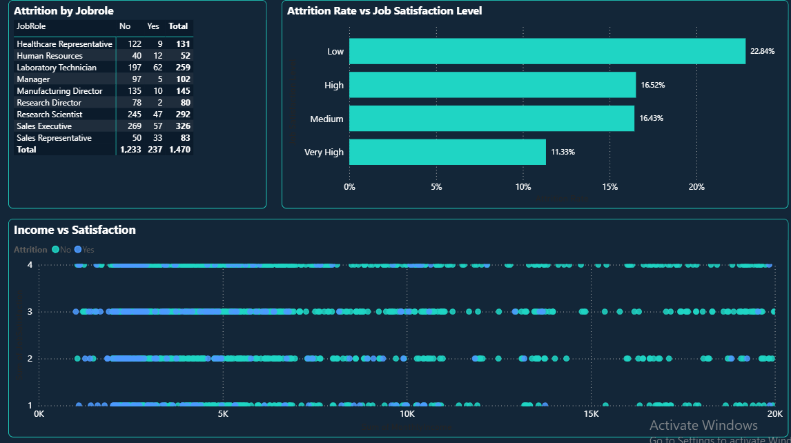

# HR Analytics Dashboard — Power BI (End-to-End, No SQL/Python)

An interactive, responsive HR attrition dashboard built **entirely inside Power BI** — from raw CSV to published report — using Power Query for ETL, a proper star schema data model, DAX (including CALCULATE, context transition, and iterators), Row-Level Security, and a custom dark theme with mobile-responsive layout.

This project was intentionally built without any external SQL or Python preprocessing, to demonstrate that the full analytics pipeline — cleaning, modeling, calculation, security, and design — can be handled natively within Power BI's own toolset.

---

## 📊 Dashboard Preview


```
/screenshots
  ├── executive_overview.png
  ├── attrition_deep_dive.png
```



---

## 📁 Dataset

**Source:** [IBM HR Analytics Employee Attrition Dataset (Kaggle)](https://www.kaggle.com/datasets/pavansubhasht/ibm-hr-analytics-attrition-dataset)

- 1,470 employee records
- 35 original attributes: Age, Attrition, Department, JobRole, MonthlyIncome, JobSatisfaction, OverTime, YearsAtCompany, and more
- Single flat-file snapshot (no transaction dates) — chosen specifically to focus the project on **categorical/numeric segmentation and Power Query shaping**, rather than time intelligence

---

## 🧹 Data Cleaning (Power Query)

All ETL was performed natively in Power Query — no external preprocessing:

- Verified and corrected data types column-by-column (Whole Number, Text)
- Removed 3 constant-value columns adding no analytical value: EmployeeCount, Over18, StandardHours
- Built two custom **conditional columns** using nested if-else logic:
  - AgeGroup — bucketed into 18-25, 26-35, 36-45, 46-55, 56+
  - IncomeBand — bucketed into Very Low, Low, Medium, High, Very High
- Split repeated categorical fields into dedicated **dimension tables** via Reference queries (not full duplicates) to reduce redundancy and follow star schema principles:
  - Dim_Department
  - Dim_JobRole
  - Dim_EducationField

---

## 🗂️ Data Model

Built as a star schema — Employees as the central fact-style table, connected directly to three dimension tables:

```
        Dim_Department
              |
Dim_JobRole — Employees — Dim_EducationField
```

- All relationships: **One-to-Many**, **Single cross-filter direction**
- Verified cardinality manually rather than relying on auto-detection

---

## 🧮 Key DAX Measures

```dax
Total Employees = COUNTROWS(Employees)

Attrition Count = CALCULATE(COUNTROWS(Employees), Employees[Attrition] = "Yes")

Attrition Rate = DIVIDE([Attrition Count], [Total Employees])

Employee Count = COUNTROWS(Employees)

Overtime Attrition Rate = 
CALCULATE(
    [Attrition Rate],
    Employees[OverTime] = "Yes"
)

Overall Attrition Rate = 
CALCULATE(
    [Attrition Rate],
    ALL(Employees)
)
```

**Calculated column (row context, using SWITCH(TRUE())):**
```dax
Job Satisfaction Level = 
SWITCH(
    TRUE(),
    Employees[JobSatisfaction] = 1, "Low",
    Employees[JobSatisfaction] = 2, "Medium",
    Employees[JobSatisfaction] = 3, "High",
    Employees[JobSatisfaction] = 4, "Very High",
    "Unknown"
)
```

**Debugging note worth mentioning:** An early version of Attrition Count (with its hardcoded Attrition = "Yes" filter) produced identical, incorrect values across both columns of a Yes/No matrix breakdown — a direct example of CALCULATE's filter arguments **overriding** rather than combining with a visual's own filter context. Fixed by introducing a plain `Employee Count` measure with no hardcoded filter, letting the matrix's column context drive the split correctly.

---

## 🔐 Row-Level Security

Implemented **Dynamic RLS** using a department-mapping table and USERPRINCIPALNAME():

```dax
[Department] = LOOKUPVALUE(
    UserDepartmentMapping[Department], 
    UserDepartmentMapping[UserEmail], 
    USERPRINCIPALNAME()
)
```

A single role (DepartmentRole) dynamically restricts each logged-in manager to their own department's data — tested and verified using Power BI's "View As Role" feature across three simulated department-manager accounts.

---

## 📱 Design & Responsiveness

- Custom dark navy + teal theme (JSON-based) applied across all visuals for a modern, professional look
- Dedicated **Mobile Layout** built for both report pages, using Power BI's native mobile view designer — same underlying visuals and data, rearranged into a single-column phone-friendly stack

---

## 🔍 Key Insights

- **Overtime is the strongest attrition driver found:** employees working overtime attrite at **31%**, compared to just **11%** for those who don't — nearly 3x higher.
- **Job satisfaction shows a clear inverse relationship with attrition:** Low satisfaction → 22.84% attrition, tapering down to 11.33% for Very High satisfaction.
- **Sales Representative has the highest relative attrition** among job roles (~40%), while Research Director is the most stable (~2.5%).
- **R&D has the highest absolute attrition count**, though Sales has a higher attrition *rate* overall — a distinction between volume and rate worth highlighting analytically.

---

## 🛠️ Tools Used

Power BI Desktop (Power Query, Data Modeling, DAX, Report Design, Row-Level Security, Mobile Layout) — no SQL, no Python, no external ETL tools.

---

## 📎 Files in This Repo

- hr.pbix — full Power BI file (download and open in Power BI Desktop to explore interactively)
- /screenshots — dashboard preview images
